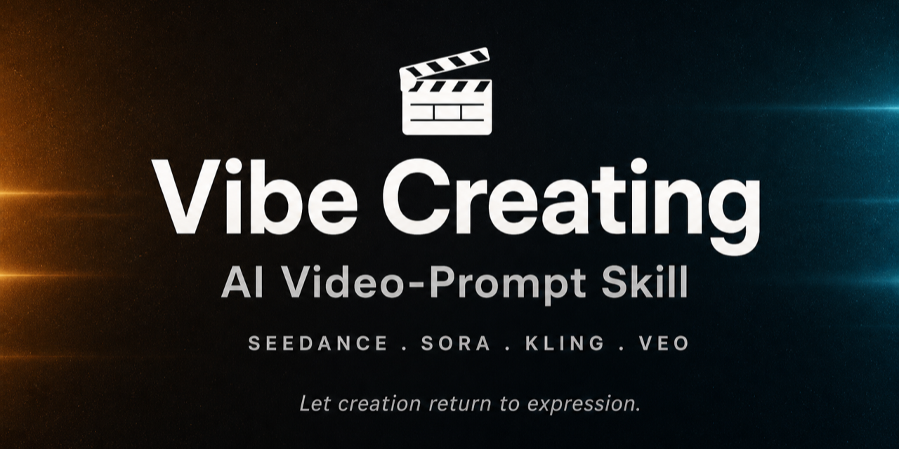

<div align="center">



**An open-source AI video-prompt skill — for Seedance, Sora, Kling, Veo & more**

*Turn a rough idea into a model-ready text-to-video prompt. Let creation return to expression.*

[](LICENSE)
[](#-install)
[](#-install)
[](CONTRIBUTING.md)


[**English**](README.md) · [**中文**](README.zh.md)

</div>

**Vibe Creating** is an open-source, bilingual **prompt-engineering skill** that rewrites a rough idea, story, feeling, or over-specified shot script into a clean, **model-friendly text-to-video prompt** — and first judges whether your input even suits this style. It follows the open [Agent Skills standard](https://agentskills.io) (a single `SKILL.md`), so it runs in **Claude Code, Codex, OpenClaw, Hermes, Cursor**, and any compatible agent — or as a system prompt in any LLM. It works with AI video models like **Seedance 2.0, Sora, Kling, Veo, Runway, Pika, and Hailuo**.

---

## ✨ What is Vibe Creating?

As text-to-video models get smarter, prompting gets *simpler*. Instead of over-specifying focal lengths, shot numbers, and frame-by-frame scripts, you focus on **telling the story** and **trust the model** to find the right shots, light, and rhythm.

**Vibe Creating** is that paradigm — introduced by ByteDance / Volcengine alongside the **Seedance 2.0** video-generation model. This repo turns its methodology into a reusable **AI video prompt skill**:

- 🎯 **Focus on Story** — describe the situation, the texture of the air, the flow of emotion; let the model interpret.
- 🤝 **Trust the Model** — drop low-value technical parameters; keep and *translate* the shot *intent*.
- 🧭 **Judgment-first** — it decides whether your input even suits this style before rewriting, so it never flattens a precise shot list you actually wanted.

It is **not** a "make everything shorter" tool. Read [the full philosophy](docs/philosophy.md) for the idea behind it.

## 🧠 How it works

The skill is *judgment-first*: it scores your input on three axes — **Scenario × Expression × Information** — picks the lightest action that fits, and always replies in the same four-part format.

```text
Input  (idea · scene · script)
  │
  ├─ Suits Vibe Creating? ───── no ─────▶ keep as-is  (explain the mismatch)
  │     │ yes
  ├─ Enough info? (4 layers) ── no ─────▶ ask first   (1–3 short questions)
  │     │ yes
  └─ How polished already?
        ├─ strong      ─▶ pass-through
        ├─ near / messy ─▶ light cleanup
        └─ execution    ─▶ direct rewrite  (strip params, translate intent)
                                │
                                ▼
        Four-part output:  Judgment · Action · Result · Notes
```

The four layers it checks for: **visual anchor** (the main subject), **action / state** (what's happening), **local tonality** (one mood word), and **video theme** (use case + visual style).

And every response comes back in that same fixed four-part format:

> **Judgment** — does it suit Vibe Creating, is it already usable, is the info enough
> **Action** — one of *pass-through / light cleanup / direct rewrite / ask first / keep as-is / optional VC version*
> **Result** — the rewritten prompt, the kept text, or a clarifying question
> **Notes** *(if any)* — what technical control was stripped, what constraints were kept

**For example —**
**You:** *Express the feeling of freedom.*
**Skill:** *Judgment:* suits VC, but too abstract to render — no visual anchor. *Action:* **ask first** — "Who is free, and where? A child in open fields, a diver, a city rooftop at dawn? Any style — photoreal, anime, ink-wash?"

## 📦 Install

The skill is one portable `SKILL.md` folder. Pick whichever option fits your setup.

**Option 1 — One-liner (recommended).** Auto-detects your installed agents and copies the skill into each:

```bash
npx github:Alisa0808/vibe-creating-skill
```

Add `--all` for every known agent, name agents explicitly (`… claude codex`), or target any folder with `--dir <path>`.

**Option 2 — Clone and copy.** Same file, different home per agent:

```bash
git clone https://github.com/Alisa0808/vibe-creating-skill.git
cp -r vibe-creating-skill/skills/vibe-creating-prompt <your-agent-skills-dir>/
```

| Agent | Skills directory |
|---|---|
| Claude Code | `~/.claude/skills/` |
| Codex CLI | `~/.codex/skills/` |
| OpenClaw | `~/.openclaw/skills/` |
| Hermes | `~/.hermes/skills/` |

**Option 3 — Any other LLM.** Paste the body of [the skill file](skills/vibe-creating-prompt/SKILL.md) (or [its Chinese edition](skills/vibe-creating-prompt/SKILL.zh.md)) as the system prompt / custom instructions in GPT, Gemini, a local model, etc.

Then restart your agent and describe what you want to film — e.g. *"a basketball kid hits a buzzer-beater three."*

## 🎬 Before & after

Real test cases from the original handbook — the **same scene**, a regular prompt vs. a Vibe Creating prompt, with the clip each one generated (videos from Volcengine's Seedance 2.0). See all eight in the [worked test cases](docs/test-cases.md), and browse the [example gallery](docs/examples/) for dozens more prompts.

### Case 2 · near-VC input → light cleanup

**Regular prompt** — A person stands in a subway car flooded with seawater; a whale swims past the window outside. Quiet and suffocating.

<video src="https://github.com/Alisa0808/vibe-creating-skill/raw/main/assets/cases/case2-regular.mp4" controls muted playsinline width="480"></video>

**✅ Vibe Creating** — In a subway car flooded by seawater, a person stands quietly, the car's interior half-submerged in dim blue water-light; handrails, seats, and windows are all steeped in a cold, damp silence. The world outside has become the deep sea — a giant whale glides slowly past the window, its vast silhouette passing the long glass without a sound, bringing a near-dreamlike pressure. The whole frame is so quiet you can only feel the presence of the water; the light sways, the air feels utterly drained — calm yet impossible to breathe in.

<video src="https://github.com/Alisa0808/vibe-creating-skill/raw/main/assets/cases/case2-vibe.mp4" controls muted playsinline width="480"></video>

**Comparison —** the input was already close to Vibe Creating, so both clips are similar; the rewrite mainly sharpens the emotional close (awe) and the implied underwater sound design.

### Case 3 · execution shot-script → direct rewrite

<details>
<summary><b>Regular prompt</b> — a 3-shot execution script (click to expand)</summary>

> **Shot 1 — a damp memory, setup (00:00–00:03) | 3s.** Framing: wide shot → full shot. Camera: static frame. Image: the heavy rain has just stopped; cold-toned mist fills the air. The flagstone road is covered in puddles, mirroring the mottled, peeling, moss-grown old walls on both sides. At the edge of frame, a pair of bright-yellow rubber rain boots, far too big for the feet inside them, slowly steps into view. The little girl, wearing the yellow boots, walks carefully to the edge of the largest puddle and stops, looking down at the huge reflection in the water. SFX: the damp, empty wind after rain; the monotonous drip off the roof tiles; the faint "squeak" of rain boots on wet flagstones.
> **Shot 2 — the standoff before the key action (00:03–00:08) | 5s (the emphasis).** Framing: extreme close-up → close-up. Camera: an extremely slow push-in. Image: the camera fixes on the girl's cheek. Her brows are tightly knit, her gaze darting between the huge puddle and the oversized yellow boots. She bites her lower lip; her nose wrinkles slightly. She takes a deep breath, her whole face showing an intensely vivid inner standoff of "I want to jump… but I don't dare." At the end of second 8, a heavy, suppressed heartbeat boom cuts in. VFX notes: extremely fine facial texture (SSS skin material); micro-capillary response under the skin; the catch of the puddle's reflected light in her eyes; raindrops dripping down her hair.
> **Shot 3 — the burst and its afterglow, reaction (00:08–00:15) | 7s.** Framing: low-angle wide shot → static medium shot. Camera: at the instant the action bursts, the camera snaps back to a fixed focus. Image: the girl drops all hesitation and jumps in with both feet; high-speed, the water bursts into countless diamond-like droplets. A dozing ginger cat is startled awake, fur on end, scrambling onto a higher wall. The frame returns to a medium shot: she lifts her head into an intensely brilliant, pure, crisp laugh, eyes wet. SFX: a violent, bass-heavy splash; the cat's scramble; clear child laughter. VFX notes: volumetric fluid simulation; slow-motion droplet physics; color saturation lifts slightly as her laughter bursts.

</details>

<video src="https://github.com/Alisa0808/vibe-creating-skill/raw/main/assets/cases/case3-regular.mp4" controls muted playsinline width="480"></video>

**✅ Vibe Creating** — The rain has just stopped; cold mist still floats in the old alley, puddles covering the flagstone road, mirroring the mottled, peeling, moss-grown walls on both sides. A pair of oversized bright-yellow rain boots walks slowly into frame; the little girl steps carefully to the largest puddle and stops, looking down at the swaying reflection. In the air there's only the damp, empty wind after rain, the intermittent dripping from the eaves, and the small sound her boots make on the wet flagstones. She stares at the puddle, then glances down at her boots, brows knit tight, lips pressed — as if waging a solemn, childlike contest with herself. She clearly wants badly to jump, yet hesitates at the very last moment. The next second she makes up her mind and jumps in with both feet; the water bursts open with a roar, great splashes shattering into bright points of light. A dozing ginger cat springs up in fright and scrambles onto a higher wall. As the water settles, she lifts her head and breaks into an unreserved, clear and brilliant laugh, eyes faintly wet — like the moment a rain-washed world is finally lit up by her own hand.

<video src="https://github.com/Alisa0808/vibe-creating-skill/raw/main/assets/cases/case3-vibe.mp4" controls muted playsinline width="480"></video>

**Comparison —** the input is a high-precision shot list, but the underlying scene is a complete emotional arc. After the technical params are stripped, the core beats (hesitation → jump → laugh) survive and the rhythm reads clearer — no parameters needed.

### Case 4 · heavy precision control → rewrite, with disclosure

<details>
<summary><b>Regular prompt</b> — a parameter-packed pre-viz (click to expand)</summary>

> Cinematic pre-viz shot, hyperrealist cinematic feel. Shot with a 21mm wide-angle prime cine lens and a large-format digital sensor, presenting a continuous, slow, tension-building dolly-in with a slight, natural Steadicam handheld sway. The frame follows the rule of thirds; a lone woman warrior enters alone from the left foreground, stepping cautiously toward the depths of a dark, deep cave. Dramatically high-contrast volumetric light (the Tyndall effect) pours down through a narrow crack in the cave roof; the camera is set to f/11 for deep depth of field, paired with a fast 1/250s shutter to freeze the thick suspended dust. The strong light creates extreme backlight (EV+4), pressing the warrior's layered gear and the heavy great-blade on her back into a tense half-silhouette. The surroundings are damp and oppressive; HDR capture with ISO 12800 brings natural low-light noise and film grain. The whole uses a desaturated dark color grading, leaning into cold-blue tones and crushed blacks.

</details>

**✅ Vibe Creating** — A hyperrealist cinematic pre-viz shot. In the cold-blue depths of a cave, a lone woman warrior steps slowly from the left foreground into the darkness, a heavy great-blade on her back, her steps cautious and alert. The camera presses forward in a slow, oppressive wide angle with a slight, natural following sway. Through a narrow crack in the cave roof, dramatic volumetric light pours down, piercing the deep gloom — drifting dust clearly visible in the beams. The strong backlight crushes her into a tense half-silhouette, leaving only the cold, hard outline of her gear and blade. The rock walls are wet and rough, faint reflections flickering in the deep shadows; high-contrast, low-saturation, heavy blacks — oppressive, deathly still, danger about to break.

<video src="https://github.com/Alisa0808/vibe-creating-skill/raw/main/assets/cases/case4-vibe.mp4" controls muted playsinline width="480"></video>

**Disclosure (shown to the user) —** "I removed the lens/exposure/grading parameters and translated them into their visual results. If you'd like to keep specific parameters or the pre-viz structure, tell me and I'll give you a constraint-preserving version."

## 🚫 When NOT to use it

Vibe Creating is for atmosphere, emotion, narrative, and visual exploration. For **precise word-for-word dialogue sync, strict shot-by-shot execution, UI demos, or step-by-step tutorials**, traditional precise prompting is the better tool — and the skill will tell you so rather than force a rewrite.

## ❓ FAQ

<details>
<summary><b>What is Vibe Creating?</b></summary>

Vibe Creating is a prompt-writing paradigm for AI video generation: instead of over-specifying camera parameters and shot-by-shot scripts, you describe the story and feeling and trust the model to interpret it. This repo packages that approach as a reusable prompt skill that rewrites your input into a model-friendly text-to-video prompt.
</details>

<details>
<summary><b>How do I write a good AI video prompt?</b></summary>

Cover four layers without naming them: a **visual anchor** (the main subject), an **action or state** (what's happening), a **local tonality** (one mood word), and a **video theme** (use case + visual style). Keep the story; drop low-value technical parameters. The skill does this for you and asks for whatever layer is missing.
</details>

<details>
<summary><b>Which video models does this work with?</b></summary>

Any text-to-video model — it was distilled from **Seedance 2.0**, and the same prompts work well with **Sora, Kling, Veo, Runway, Pika, and Hailuo**. The output is plain natural-language description, not model-specific syntax.
</details>

<details>
<summary><b>Which agents does this work with?</b></summary>

Any agent that supports the open Agent Skills (`SKILL.md`) standard — **Claude Code, Codex, OpenClaw, Hermes, Cursor**, and others — or any LLM at all, by pasting the skill as a system prompt.
</details>

<details>
<summary><b>How is this different from just writing a longer, detailed prompt?</b></summary>

Vibe Creating is not "longer" or "shorter" — it's *the right information*. It removes ineffective technical noise and keeps the story, emotion, and key imagery, so the model locks onto your intent. It also refuses to rewrite inputs that genuinely need precise control (dialogue sync, UI demos), instead of forcing every prompt into one style.
</details>

<details>
<summary><b>Is this an official ByteDance / Seedance project?</b></summary>

No. It's an independent, faithful open-source port of a publicly-shared methodology. See [Attribution & license](#-attribution--license) and the [NOTICE](NOTICE) file.
</details>

## 🤝 Contributing

Translations, new gallery prompts, and refinements welcome — see the [contributing guide](CONTRIBUTING.md).

## 📄 Attribution & license

The **Vibe Creating** paradigm, the original skill draft, and the example prompts originate from **ByteDance / Volcengine** (created with **Seedance 2.0**). This repository is an independent, faithful English/bilingual port of that publicly-shared methodology, not an official product. See the [NOTICE](NOTICE) file for full attribution.

Code and documentation in this repo are released under the [MIT License](LICENSE). The underlying paradigm and any trademarks remain with their original owners.
