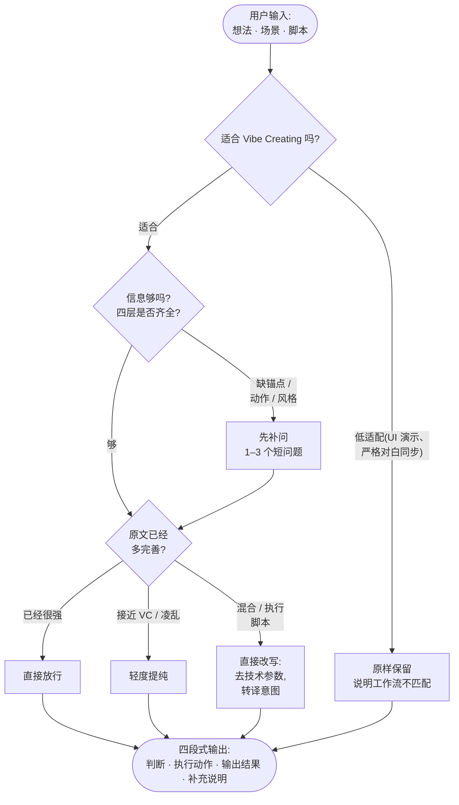

<div align="center">

# 🎬 Vibe Creating

**开源的 AI 视频提示词 Skill —— 适配 Seedance、Sora、Kling、Veo 等**

*把一个粗糙想法变成模型可直接生成的文生视频提示词。让创作回归「表达」本身。*

[](LICENSE)
[](#-安装)
[](#-安装)
[](CONTRIBUTING.md)


[**English**](README.md) · [**中文**](README.zh.md)

</div>

**Vibe Creating** 是一个开源、双语的**提示词工程 Skill**:把一个粗糙想法、故事、感觉或过度细化的分镜脚本,改写成干净、**模型友好的文生视频提示词**——并且会先判断你的输入是否适合这种风格。它遵循开放的 [Agent Skills](https://www.agentskills.io) 标准(单个 `SKILL.md`),因此可在 **Claude Code、Codex、OpenClaw、Hermes、Cursor** 等 agent 中运行,也可作为系统提示词用于任意 LLM。它适用于 **Seedance 2.0、Sora、Kling、Veo、Runway、Pika、海螺(Hailuo)** 等 AI 视频模型。

> 关键词:*AI 视频提示词 · 文生视频 · text-to-video · 提示词优化 / 改写 · Seedance / Sora / Kling / Veo 提示词 · agent skill · Claude / Codex / OpenClaw / Hermes skill · 生成式 AI 视频。*

---

## ✨ 什么是 Vibe Creating？

随着文生视频模型越来越聪明,提示词反而越写越**简单**。与其逐帧规定焦段、镜头号和分镜脚本,不如专注**讲好故事**,**信任模型**自行找到合适的景别、光影和节奏。

**Vibe Creating** 就是这一范式——由字节跳动 / 火山引擎在 **Seedance 2.0** 模型发布时提出。本仓库把它的方法论沉淀为一个可复用的**AI 视频提示词 Skill**:

- 🎯 **讲好故事(Focus on Story)**——描述处境、空气的质感、情绪的流向,让模型去诠释。
- 🤝 **信任模型(Trust the Model)**——删掉低价值技术参数,保留并**转译**镜头*意图*。
- 🧭 **判断优先**——先判断你的输入是否适合这种风格再改写,绝不把你真正需要的精确分镜稿压平。

它**不是**一个「一律改短」的工具。完整理念见 [docs/philosophy.zh.md](docs/philosophy.zh.md)。

## 🧠 工作原理

Skill 是**判断优先**的:在三个维度上给输入打分——**场景 × 表达 × 信息**——选出最贴合的最轻动作,并始终用同一套四段式格式回复。



它检查的四层:**视觉锚点**(主体)、**行为 / 状态**(在发生什么)、**局部调性**(一个氛围词)、**视频主题**(应用场景 + 画面风格)。

## 📦 安装

Skill 就是一个可移植的 `SKILL.md` 文件夹,放进你的 agent 的 skills 目录即可。

**一键安装(自动识别你已装的 agent):**

```bash
npx github:Alisa0808/vibe-creating-skill
```

加 `--all` 给所有 agent 安装,显式指定(`… claude codex`),或用 `--dir <path>` 指向任意目录。

**或者自己克隆 + 复制**——同一个文件,不同 agent 放在不同目录:

```bash
git clone https://github.com/Alisa0808/vibe-creating-skill.git
cp -r vibe-creating-skill/skills/vibe-creating-prompt <你的-agent-skills-目录>/
```

| Agent | skills 目录 |
|---|---|
| Claude Code | `~/.claude/skills/` |
| Codex CLI | `~/.codex/skills/` |
| OpenClaw | `~/.openclaw/skills/` |
| Hermes | `~/.hermes/skills/` |
| 任意其他 LLM | 把 [`SKILL.zh.md`](skills/vibe-creating-prompt/SKILL.zh.md) 粘贴为系统提示词 |

然后重启 agent,直接描述你想拍什么——例如*「篮球少年最后一秒压哨三分绝杀」*。英文版为 [`SKILL.md`](skills/vibe-creating-prompt/SKILL.md)。

## 💬 你会得到什么

每次回复都采用固定四段式:

> **判断**——是否适合 VC、原文是否已可用、信息是否充分
> **执行动作**——*直接放行 / 轻度提纯 / 直接改写 / 先补问 / 原样保留 / 可选 VC 版* 取其一
> **输出结果**——改写后的提示词、原样保留文本,或补问
> **补充说明**(如有)——本次删除了哪些技术控制、保留了哪些硬约束

**示例 ——**
**你:**「表达自由的感觉」
**Skill:** *判断:*适合 VC,但过于抽象、无法直接生成——缺少视觉锚点。*执行动作:***先补问**——「谁在自由?在哪里?旷野奔跑的孩子、潜水者、还是破晓的城市天台?想要什么风格——超写实、动画、还是水墨?」

更多见 [docs/test-cases.md](docs/test-cases.md) 和[示例画廊](docs/examples/)。

## 🚫 什么时候不该用

Vibe Creating 适合氛围、情绪、叙事和视觉探索。对于**精确逐字对白同步、严格分镜执行、UI 演示或步骤教程**,传统精确提示词是更好的工具——Skill 会直接告诉你,而不是强行改写。

## ❓ 常见问题 FAQ

### 什么是 Vibe Creating？
Vibe Creating 是一种面向 AI 视频生成的提示词写法:与其逐帧堆砌镜头参数和分镜脚本,不如描述故事和感受,信任模型去诠释。本仓库把它封装成一个可复用的提示词 Skill,帮你把输入改写成模型友好的文生视频提示词。

### 怎么写出一条好的 AI 视频提示词？
覆盖四层(不必点名):**视觉锚点**(主体)、**行为或状态**(在发生什么)、**局部调性**(一个氛围词)、**视频主题**(应用场景 + 画面风格)。保留故事,删掉低价值技术参数。Skill 会替你做这件事,并补问缺失的那一层。

### 支持哪些视频模型？
任意文生视频模型——它源自 **Seedance 2.0**,同样的提示词在 **Sora、Kling、Veo、Runway、Pika、海螺(Hailuo)** 上也好用。输出是自然语言画面描述,不是某个模型的专用语法。

### 支持哪些 agent？
任何支持开放 Agent Skills(`SKILL.md`)标准的 agent——**Claude Code、Codex、OpenClaw、Hermes、Cursor** 等——或任意 LLM(把 skill 当系统提示词粘贴)。

### 和直接写一条更长更详细的提示词有什么区别？
Vibe Creating 不是「更长」或「更短」,而是「给对信息」。它去掉无效的技术噪声,保留故事、情绪和关键意象,让模型锁定你的意图。它还会拒绝改写那些真正需要精确控制的输入(对白同步、UI 演示),而不是把所有提示词强行套进一种风格。

### 这是字节跳动 / Seedance 官方项目吗？
不是。这是对一份公开方法论的独立、忠实的开源整理。见[署名与协议](#-署名与协议)和 [NOTICE](NOTICE)。

## 🤝 参与贡献

欢迎补充翻译、新增画廊提示词、打磨细节——见 [CONTRIBUTING.md](CONTRIBUTING.md)。

## 📄 署名与协议

**Vibe Creating** 范式、原始 Skill 草稿及示例提示词均来自**字节跳动 / 火山引擎**(基于 **Seedance 2.0** 创作)。本仓库是对该公开方法论的独立、忠实的英文/双语整理,并非官方产品。完整署名见 [NOTICE](NOTICE)。

本仓库的代码与文档以 [MIT 协议](LICENSE)发布。底层范式及任何商标归原始所有者所有。
