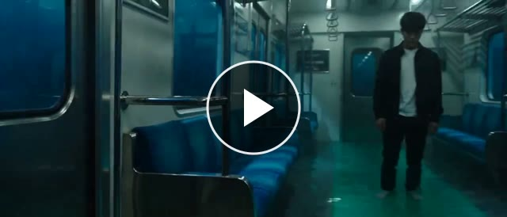
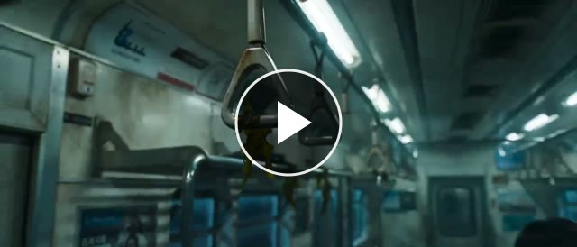
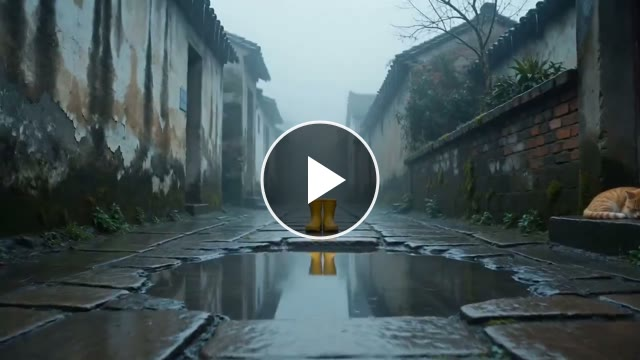
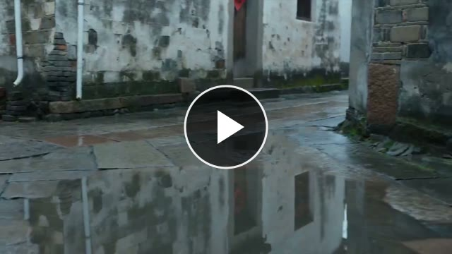
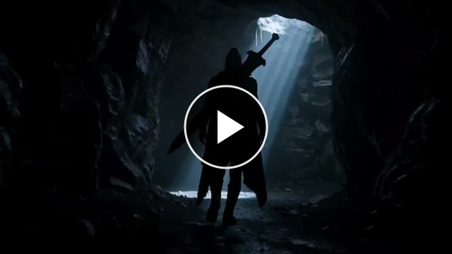

<div align="center">


**开源的 AI 视频提示词 Skill —— 适配 Seedance、Sora、Kling、Veo 等**

*把一个粗糙想法变成模型可直接生成的文生视频提示词。让创作回归「表达」本身。*

[](LICENSE)
[](#-安装)
[](#-安装)
[](CONTRIBUTING.md)


[**English**](README.md) · [**中文**](README.zh.md)

</div>

**Vibe Creating** 是一个开源、双语的**提示词工程 Skill**:把一个粗糙想法、故事、感觉或过度细化的分镜脚本,改写成干净、**模型友好的文生视频提示词**——并且会先判断你的输入是否适合这种风格。它遵循开放的 [Agent Skills 标准](https://agentskills.io)(单个 `SKILL.md`),因此可在 **Claude Code、Codex、OpenClaw、Hermes、Cursor** 等 agent 中运行,也可作为系统提示词用于任意 LLM。它适用于 **Seedance 2.0、Sora、Kling、Veo、Runway、Pika、海螺(Hailuo)** 等 AI 视频模型。

---

## ✨ 什么是 Vibe Creating？

随着文生视频模型越来越聪明,提示词反而越写越**简单**。与其逐帧规定焦段、镜头号和分镜脚本,不如专注**讲好故事**,**信任模型**自行找到合适的景别、光影和节奏。

**Vibe Creating** 就是这一范式——由字节跳动 / 火山引擎在 **Seedance 2.0** 模型发布时提出。本仓库把它的方法论沉淀为一个可复用的**AI 视频提示词 Skill**:

- 🎯 **讲好故事(Focus on Story)**——描述处境、空气的质感、情绪的流向,让模型去诠释。
- 🤝 **信任模型(Trust the Model)**——删掉低价值技术参数,保留并**转译**镜头*意图*。
- 🧭 **判断优先**——先判断你的输入是否适合这种风格再改写,绝不把你真正需要的精确分镜稿压平。

它**不是**一个「一律改短」的工具。完整理念见[创作理念文档](docs/philosophy.zh.md)。

## 🧠 工作原理

Skill 是**判断优先**的:在三个维度上给输入打分——**场景 × 表达 × 信息**——选出最贴合的最轻动作,并始终用同一套四段式格式回复。

```text
输入  (想法 · 场景 · 脚本)
  │
  ├─ 适合 Vibe Creating 吗? ──── 否 ────▶ 原样保留  (说明工作流不匹配)
  │     │ 是
  ├─ 信息够吗? (四层结构) ───── 否 ────▶ 先补问    (1–3 个短问题)
  │     │ 是
  └─ 原文已经多完善?
        ├─ 已经很强    ─▶ 直接放行
        ├─ 接近 / 凌乱 ─▶ 轻度提纯
        └─ 执行脚本    ─▶ 直接改写  (去技术参数,转译意图)
                               │
                               ▼
        四段式输出:  判断 · 执行动作 · 输出结果 · 补充说明
```

它检查的四层:**视觉锚点**(主体)、**行为 / 状态**(在发生什么)、**局部调性**(一个氛围词)、**视频主题**(应用场景 + 画面风格)。

而且每次回复都用同一套固定四段式:

> **判断**——是否适合 VC、原文是否已可用、信息是否充分
> **执行动作**——*直接放行 / 轻度提纯 / 直接改写 / 先补问 / 原样保留 / 可选 VC 版* 取其一
> **输出结果**——改写后的提示词、原样保留文本,或补问
> **补充说明**(如有)——本次删除了哪些技术控制、保留了哪些硬约束

**举个例子 ——**
**你:**「表达自由的感觉」
**Skill:** *判断:*适合 VC,但过于抽象、无法直接生成——缺少视觉锚点。*执行动作:***先补问**——「谁在自由?在哪里?旷野奔跑的孩子、潜水者、还是破晓的城市天台?想要什么风格——超写实、动画、还是水墨?」

## 📦 安装

Skill 就是一个可移植的 `SKILL.md` 文件夹,按你的环境选一种方式。

**方式 1 —— 一键安装(推荐)。** 自动识别你已装的 agent 并逐个复制:

```bash
npx github:Alisa0808/vibe-creating-skill
```

加 `--all` 给所有已知 agent 安装,显式指定(`… claude codex`),或用 `--dir <path>` 指向任意目录。

**方式 2 —— 克隆 + 复制。** 同一个文件,不同 agent 放在不同目录:

```bash
git clone https://github.com/Alisa0808/vibe-creating-skill.git
cp -r vibe-creating-skill/skills/vibe-creating-prompt <你的-agent-skills-目录>/
```

| Agent | skills 目录 |
|---|---|
| Claude Code | `~/.claude/skills/` |
| Codex CLI | `~/.codex/skills/` |
| OpenClaw | `~/.openclaw/skills/` |
| Hermes | `~/.hermes/skills/` |

**方式 3 —— 任意其他 LLM。** 把[技能文件](skills/vibe-creating-prompt/SKILL.zh.md)(或[英文版](skills/vibe-creating-prompt/SKILL.md))的正文粘贴为 GPT、Gemini、本地模型等的系统提示词 / 自定义指令。

然后重启 agent,直接描述你想拍什么——例如*「篮球少年最后一秒压哨三分绝杀」*。

## 🎬 实测对比

来自原始手册的真实测试案例——**同一个场景**,常规提示词 vs Vibe Creating 提示词,以及各自生成的视频(视频来自火山引擎 Seedance 2.0)。完整八个见[测试案例](docs/test-cases.md),更多提示词见[示例画廊](docs/examples/)。

### Case 2 · 接近 VC 的输入 → 轻度提纯

<table>
<tr><th>维度</th><th width="42%">用户输入 · 常规提示词</th><th width="42%">✅ Skill 输出 · Vibe Creating</th></tr>
<tr>
<td valign="top"><b>提示词</b></td>
<td valign="top">一个人站在被海水淹没的地铁车厢里,窗外有鲸鱼游过,安静又窒息。</td>
<td valign="top">被海水淹没的地铁车厢里,一个人安静地站着,车厢内部半沉在幽蓝的水光中,扶手、座椅和车窗都浸透着冰冷潮湿的寂静。外面的世界像已经变成深海,一只巨大的鲸鱼缓慢地从车窗外游过,庞大的身影无声掠过狭长的玻璃,带来一种近乎梦境的压迫感。整个画面安静得只能感觉到水的存在,光线摇晃,空气像被彻底抽空,既平静又让人无法呼吸。</td>
</tr>
<tr>
<td valign="top"><b>生成测试</b></td>
<td><a href="assets/cases/case2-regular.mp4"></a></td>
<td><a href="assets/cases/case2-vibe.mp4"></a></td>
</tr>
<tr>
<td valign="top"><b>对比备注</b></td>
<td colspan="2">原输入已接近 Vibe Creating,两版效果整体相近;改写版在情绪收尾(震惊/敬畏)和水下音效设计上略胜,情绪弧度更完整。</td>
</tr>
</table>

<sub>▶ 点击任一片段可打开完整带声音的视频。</sub>

### Case 3 · 执行型镜头稿 → 直接改写

<table>
<tr><th>维度</th><th width="42%">用户输入 · 常规提示词</th><th width="42%">✅ Skill 输出 · Vibe Creating</th></tr>
<tr>
<td valign="top"><b>提示词</b></td>
<td valign="top"><details><summary>三镜头执行稿(点击展开)</summary><br><b>镜头一 · setup(00:00–00:03)</b>:全景→全身,静态定焦。大雨刚停,空气弥漫冷色调雾气,石板路布满积水,倒映斑驳掉漆、长满苔藓的老墙。一双过于肥大的明黄色雨靴缓缓步入,小女孩走到最大的水坑边停住,低头凝视倒影。音效:雨后潮湿空旷的风声、屋檐滴水声、雨靴踩湿石板的"唧唧"声。<br><br><b>镜头二 · 博弈(00:03–00:08)</b>:大特写→特写,极缓慢推进。她紧锁双眉,目光在水坑和雨靴间游移,咬着下唇,鼻子因紧张皱起,呈现"我要跳……但不敢"。第8秒末切入沉重心跳轰鸣。特效:SSS 皮肤材质、皮下微血管反应、眼球对积水反射光、雨珠沿发滴落。<br><br><b>镜头三 · 爆发(00:08–00:15)</b>:低角度全景→静态中景。她收起犹豫并脚跳进水坑,高速摄影下积水炸裂成碎钻般水珠;打盹的橘猫被惊得蹦上矮墙;她抬头爆发出灿烂清脆的笑,眼眶湿润。音效:重低音溅水声、猫咪嘶嘶声、清脆笑声。特效:流体动力学模拟、水珠慢动作物理、结尾饱和度轻微提升。</details></td>
<td valign="top">雨刚停,冷冷的雾气还浮在老巷里,石板路上布满积水,倒映着两侧斑驳掉漆、长满苔藓的旧墙。一双过于肥大的明黄色雨靴慢慢走进画面,小女孩小心翼翼地来到最大的水坑前停下,低头望着那片晃动的倒影。空气里只有雨后潮湿空旷的风声、屋檐断续滴水的声音,和雨靴踩过湿石板时轻轻发出的细小声响。她盯着水坑,又低头看自己的雨靴,眉头紧紧皱着,嘴唇微微抿住,像在和自己做一场郑重又幼小的较量。她明明已经很想跳下去,却还是在最后一刻犹豫。下一秒,她忽然下定决心,整个人猛地并脚跳进水坑,积水轰然炸开,大片水花在空中碎成明亮的光点。旁边一只原本打盹的橘猫被惊得猛然弹起,仓皇跃上更高的矮墙。水声落下之后,小女孩站在满地残水的石板路上抬起头,脸上爆发出毫无保留、清脆灿烂的笑,眼眶微微湿润,像一个雨后世界终于被她亲手点亮的瞬间。</td>
</tr>
<tr>
<td valign="top"><b>生成测试</b></td>
<td><a href="assets/cases/case3-regular.mp4"></a></td>
<td><a href="assets/cases/case3-vibe.mp4"></a></td>
</tr>
<tr>
<td valign="top"><b>对比备注</b></td>
<td colspan="2">原输入是高精度分镜执行稿,但底层是完整的情绪叙事。去掉技术参数后,画面核心(犹豫→跳水→大笑)完整保留,节奏反而更清晰——无需参数也能成片。</td>
</tr>
</table>

<sub>▶ 点击任一片段可打开完整带声音的视频。</sub>

### Case 4 · 大量精准控制 → 改写并显式告知

<table>
<tr><th>维度</th><th width="42%">用户输入 · 常规提示词</th><th width="42%">✅ Skill 输出 · Vibe Creating</th></tr>
<tr>
<td valign="top"><b>提示词</b></td>
<td valign="top"><details><summary>塞满参数的电影级预演稿(点击展开)</summary><br>电影级预演(Pre-viz)镜头,超写实主义电影感。使用 21mm 广角定焦电影镜头和大画幅传感器,连续缓慢、营造紧张的向前推拉(Dolly-in),带轻微斯坦尼康摇晃。三分法构图;一名女战士孤身从左侧前景走向黑暗幽深的洞穴。高对比度体积光(丁达尔效应)穿透洞顶裂口倾泻;光圈 f/11 控制大景深,1/250 秒快门定格悬浮尘埃。强逆光(EV+4)把她的装备与巨刃压成半剪影。潮湿压迫;HDR + ISO 12800 带来自然低光噪点与颗粒感;降低饱和度的暗调色彩分级,冷蓝调、压抑黑场。</details></td>
<td valign="top">超写实主义电影级预演镜头,冷蓝调的洞穴深处,一名女战士孤身从左侧前景缓慢步入黑暗,背负重型巨刃,步伐谨慎而警觉。摄影机以压迫感十足的广角视角持续缓慢向前逼近,带着轻微自然的跟随晃动。洞顶狭窄裂口中倾泻下极具戏剧性的体积光,刺穿深邃幽暗,尘埃浮尘在光束中清晰可见。强烈逆光将她压成充满张力的半剪影,只留下战斗装备与巨刃边缘冷硬锋利的轮廓。四周岩壁湿润粗粝,深邃阴影中偶尔闪出微弱反光,整体画面高对比、低饱和、黑场沉重,压迫、肃杀、危险一触即发。</td>
</tr>
<tr>
<td valign="top"><b>生成测试</b></td>
<td valign="middle" align="center"><sub>—— 参数已删除,无单独片段 ——</sub></td>
<td><a href="assets/cases/case4-vibe.mp4"></a></td>
</tr>
<tr>
<td valign="top"><b>显式告知</b></td>
<td colspan="2">展示给用户:「这版默认弱化了你原文中的部分纯技术参数。如果你要,我可以再给两版:① 参数保留版(保留 21mm、f/11、1/250、EV+4、ISO 12800、HDR、调色等术语);② Seedance 精简版(更短、可直接投喂)。」</td>
</tr>
</table>

<sub>▶ 点击片段可打开完整带声音的视频。</sub>

**显式告知(展示给用户)——**「这版默认弱化了你原文中的部分纯技术参数。如果你要,我可以再给两版:① 参数保留版(保留 21mm、f/11、1/250、EV+4、ISO 12800、HDR、调色等术语);② Seedance 精简版(更短、可直接投喂)。」

## 🚫 什么时候不该用

Vibe Creating 适合氛围、情绪、叙事和视觉探索。对于**精确逐字对白同步、严格分镜执行、UI 演示或步骤教程**,传统精确提示词是更好的工具——Skill 会直接告诉你,而不是强行改写。

## ❓ 常见问题 FAQ

<details>
<summary><b>什么是 Vibe Creating？</b></summary>

Vibe Creating 是一种面向 AI 视频生成的提示词写法:与其逐帧堆砌镜头参数和分镜脚本,不如描述故事和感受,信任模型去诠释。本仓库把它封装成一个可复用的提示词 Skill,帮你把输入改写成模型友好的文生视频提示词。
</details>

<details>
<summary><b>怎么写出一条好的 AI 视频提示词？</b></summary>

覆盖四层(不必点名):**视觉锚点**(主体)、**行为或状态**(在发生什么)、**局部调性**(一个氛围词)、**视频主题**(应用场景 + 画面风格)。保留故事,删掉低价值技术参数。Skill 会替你做这件事,并补问缺失的那一层。
</details>

<details>
<summary><b>支持哪些视频模型？</b></summary>

任意文生视频模型——它源自 **Seedance 2.0**,同样的提示词在 **Sora、Kling、Veo、Runway、Pika、海螺(Hailuo)** 上也好用。输出是自然语言画面描述,不是某个模型的专用语法。
</details>

<details>
<summary><b>支持哪些 agent？</b></summary>

任何支持开放 Agent Skills(`SKILL.md`)标准的 agent——**Claude Code、Codex、OpenClaw、Hermes、Cursor** 等——或任意 LLM(把 skill 当系统提示词粘贴)。
</details>

<details>
<summary><b>和直接写一条更长更详细的提示词有什么区别？</b></summary>

Vibe Creating 不是「更长」或「更短」,而是「给对信息」。它去掉无效的技术噪声,保留故事、情绪和关键意象,让模型锁定你的意图。它还会拒绝改写那些真正需要精确控制的输入(对白同步、UI 演示),而不是把所有提示词强行套进一种风格。
</details>

<details>
<summary><b>这是字节跳动 / Seedance 官方项目吗？</b></summary>

不是。这是对一份公开方法论的独立、忠实的开源整理。见[署名与协议](#-署名与协议)和 [NOTICE](NOTICE) 文件。
</details>

## 🤝 参与贡献

欢迎补充翻译、新增画廊提示词、打磨细节——见[贡献指南](CONTRIBUTING.md)。

## 📄 署名与协议

**Vibe Creating** 范式、原始 Skill 草稿及示例提示词均来自**字节跳动 / 火山引擎**(基于 **Seedance 2.0** 创作)。本仓库是对该公开方法论的独立、忠实的英文/双语整理,并非官方产品。完整署名见 [NOTICE](NOTICE) 文件。

本仓库的代码与文档以 [MIT 协议](LICENSE)发布。底层范式及任何商标归原始所有者所有。
